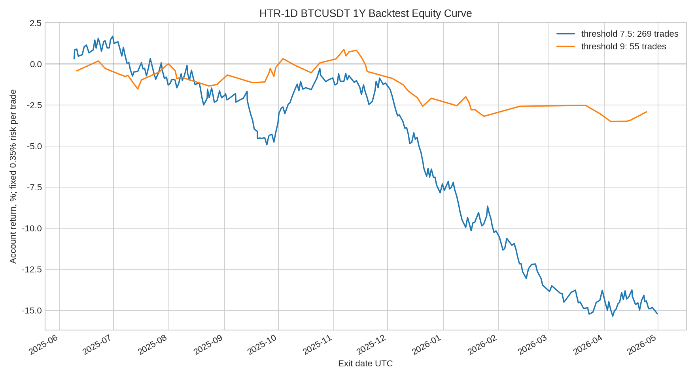

# BTCUSDT HTR-1D 高杠杆日内策略一年回测报告

作者：**Manus AI**  
数据区间：**2025-05-01T00:00:00.000Z 至 2026-04-30T23:45:00.000Z**  
数据源：**Binance Data Vision futures monthly klines BTCUSDT 15m**  
基础周期：**15m**，并由 15m 重采样生成 4H 趋势过滤。样本包含 **35040** 根 15m K 线。

> 重要结论：这套「高胜率、高回报、尽量每日一单」规则在 2025-05 至 2026-04 的 BTCUSDT 永续 15m 数据上，**没有跑出正期望**。越接近每日一单，亏损越明显；越严格，回撤变小但频率降到约每 6.6 天一单，仍然不是可直接实盘的版本。

## 回测规则摘要

本次把策略转成机械规则：4H 趋势确认、VWAP / TPO 价值区、扫流动性、CVD 估算确认、成交量与实体过滤、关键目标 RR 过滤。每个 UTC 日期最多一笔，入场窗口限制在欧洲盘与美盘主要交易时段。出场使用分批止盈：40% at 1R、35% at 2R、25% at 3R，价格达到 1R 后将余仓止损移动至入场附近。账户风险固定为每笔 **0.35%**；20–50 倍杠杆只作为保证金效率约束，平均止损距离若过大则不允许进入高杠杆版本。

| 信号阈值 | 原始信号 | 实际交易 | 天/笔 | 胜率 | PF | 期望值 | 总R | 账户收益 | 最大回撤 | 平均止损 | 平均杠杆 |
|---:|---:|---:|---:|---:|---:|---:|---:|---:|---:|---:|---:|
| 7.5 | 1074 | 269 | 1.36 | 50.56% | 0.73 | -0.162R | -43.45R | -15.21% | 17.05% | 0.435% | 37.1x |
| 8 | 291 | 173 | 2.11 | 47.40% | 0.67 | -0.212R | -36.74R | -12.86% | 15.58% | 0.447% | 36.8x |
| 8.5 | 231 | 148 | 2.47 | 48.65% | 0.70 | -0.187R | -27.68R | -9.69% | 12.84% | 0.454% | 36.6x |
| 9 | 61 | 55 | 6.64 | 50.91% | 0.75 | -0.151R | -8.31R | -2.91% | 4.38% | 0.366% | 41.5x |

## 结果解释

最接近「每天一单」的是 **7.5 分阈值**，一年实际交易 **269 笔**，约 **1.36 天一笔**，但胜率只有 **50.56%**，Profit Factor 仅 **0.73**，总结果为 **-15.21%**。这说明信号数量足够，但信号质量不足以覆盖手续费、噪声和高杠杆下的小止损误差。

相对表现较好的版本是 **9 分阈值**，一年 **55 笔**，胜率 **50.91%**，PF **0.75**，亏损缩小到 **-2.91%**，但频率降到 **6.64 天一笔**。这代表「强过滤」确实可以降低坏交易，但还不能同时满足高胜率、高回报与每日一单三个目标。

## 风险结论

这次回测的结论不是「马上上 20–50 倍」，而是：当前规则还需要继续优化。尤其是 CVD 这里只能用 K 线涨跌方向近似，不能替代真实主动买卖量；TPO 也使用 15m K 线滚动轮廓近似，不能等同交易所逐笔成交分布。因此，本结果适合作为策略筛选的第一轮压力测试，而不是实盘承诺。

我建议下一轮优化方向是把目标从「每天一定一单」改成「只做 A+ 日，每周 2–4 单」，同时加入更严格的波动率 regime、前一日高低点位置、资金费率与多空比过滤。若必须维持每日一单，则需要降低 RR 目标、引入均值回归版本，或把标的扩大到 ETH / SOL / BNB 等多币种轮动，否则单一 BTCUSDT 很难稳定提供每天一个高质量 20–50 倍信号。

## 输出文件

| 文件 | 内容 |
|---|---|
| `htr_1d_daily_backtest_1y.json` | 完整参数敏感性结果与每笔交易明细 |
| `htr_1d_trades_threshold_7_5.csv` | 接近每日一单版本的全部交易 |
| `htr_1d_trades_threshold_9.csv` | 严格过滤版本的全部交易 |
| `htr_1d_daily_equity_curve.png` | 权益曲线图 |
