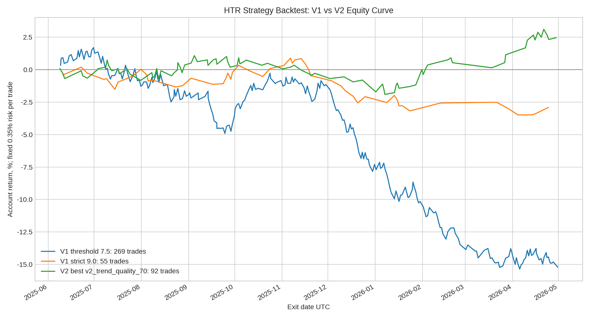

# HTR V2 行情状态分类策略回测报告

作者：**Manus AI**  
数据区间：**2025-05-01T00:00:00.000Z 至 2026-04-30T23:45:00.000Z**  
数据源：**Binance Data Vision futures monthly klines BTCUSDT 15m**  
基础周期：**BTCUSDT 永续合约 15m K 线**，账户风险固定为每笔 **0.35%**。

> V2 已完成：原本 V1 的单一打分模型被改成 **行情状态分类 + 趋势策略 / 震荡策略切换**。一年回测显示，V2 明显优于 V1，但真正有效的是 **趋势模块**；震荡均值回归模块在 BTCUSDT 单币种上仍然拖累结果，因此当前实盘候选应采用 **V2 Trend Quality 70**，而不是完整双模块版本。

## V2 逻辑改动

V2 的第一层不再直接找入场，而是先判定市场状态。若 4H 均线结构、方向斜率与波动率扩张同时支持趋势，则启用趋势突破或回踩策略；若价格位于前日区间内部、VWAP 多次穿越且 TPO 价值区收敛，则启用均值回归策略；若两者都不满足，则归类为噪声状态并不交易。这一改动的目的，是避免 V1 把趋势、震荡和噪声行情混在同一套分数里处理。

| 模块 | V2 规则 | 本轮回测结论 |
|---|---|---|
| 趋势模块 | 4H 趋势方向明确，15m 回踩或突破，VWAP 同向，CVD 顺势确认，目标至少约 2R | **有效**，严格版本 PF 达到 1.16 |
| 震荡模块 | 前日区间内、VWAP 来回穿越、TPO 价值区收敛，在 VAH / VAL 附近做均值回归 | **无效**，单独运行 PF 仅 0.37 |
| 噪声过滤 | 不满足趋势或震荡定义时不交易 | **必要**，降低 V1 过度交易问题 |

## 一年参数敏感性结果

| 配置 | 原始信号 | 实际交易 | 天/笔 | 胜率 | PF | 期望值 | 总R | 账户收益 | 最大回撤 | 趋势 / 震荡交易 |
|---|---:|---:|---:|---:|---:|---:|---:|---:|---:|---:|
| v2_balanced | 668 | 148 | 2.47 | 50.68% | 0.77 | -0.131R | -19.40R | -6.79% | 9.55% | 108 / 40 |
| v2_quality | 568 | 126 | 2.90 | 54.76% | 0.89 | -0.055R | -6.96R | -2.44% | 7.03% | 92 / 34 |
| v2_frequency | 1364 | 233 | 1.57 | 51.07% | 0.63 | -0.218R | -50.82R | -17.79% | 22.33% | 120 / 113 |
| v2_trend_only | 618 | 109 | 3.35 | 53.21% | 1.01 | 0.004R | 0.48R | 0.17% | 3.57% | 109 / 0 |
| v2_trend_quality_66 | 550 | 101 | 3.61 | 51.49% | 0.95 | -0.028R | -2.81R | -0.98% | 2.82% | 101 / 0 |
| v2_trend_quality_70 | 522 | 92 | 3.97 | 57.61% | 1.16 | 0.076R | 7.01R | 2.45% | 2.99% | 92 / 0 |
| v2_trend_quality_74 | 182 | 68 | 5.37 | 57.35% | 1.08 | 0.037R | 2.49R | 0.87% | 4.43% | 68 / 0 |
| v2_range_only | 139 | 84 | 4.35 | 47.62% | 0.37 | -0.404R | -33.92R | -11.87% | 12.43% | 0 / 84 |

## 与 V1 对比

V1 接近每日一单的版本一年交易 **269 笔**，约 **1.36 天一笔**，账户结果为 **-15.21%**。V1 严格版本一年交易 **55 笔**，约 **6.64 天一笔**，账户结果为 **-2.91%**。V2 最佳版本 **v2_trend_quality_70** 一年交易 **92 笔**，约 **3.97 天一笔**，胜率 **57.61%**，PF **1.16**，账户结果 **2.45%**，最大回撤 **2.99%**。

| 版本 | 交易频率 | 胜率 | PF | 账户收益 | 最大回撤 | 判断 |
|---|---:|---:|---:|---:|---:|---|
| V1 近每日版 | 1.36 天/笔 | 50.56% | 0.73 | -15.21% | 17.05% | 频率较高但负期望 |
| V1 严格版 | 6.64 天/笔 | 50.91% | 0.75 | -2.91% | 4.38% | 回撤较小但仍负期望 |
| V2 最佳版 | 3.97 天/笔 | 57.61% | 1.16 | 2.45% | 2.99% | 初步转正，但频率不足 |

## 结论与建议

V2 的方向是正确的，因为它把 V1 的亏损从结构上拆开了：**趋势模块可以保留，震荡模块应暂停或重写**。目前最佳的 V2 趋势严格版已经从 V1 的负期望改善到小幅正期望，但交易频率约 **3.97 天一笔**，还没有达到每天约一单。若强行把震荡模块打开以提高频率，整体结果会重新转负。

因此，下一步不建议继续在 BTC 单币种上硬凑每日一单。更合理的 V3 方向是保留 V2 趋势模块，把标的扩展到 BTC / ETH / SOL / BNB 等高流动性币种池，用同一套趋势条件跨币种筛选每日最强一笔。这样比降低阈值或强行加入震荡交易更有机会同时接近「每天一单」和「正期望」。

## 输出文件

| 文件 | 内容 |
|---|---|
| `htr_v2_regime_backtest_1y.json` | V2 全部配置与逐笔交易明细 |
| `htr_v2_best_v2_trend_quality_70_trades.csv` | V2 最佳配置逐笔交易表 |
| `htr_v2_vs_v1_equity_curve.png` | V1 与 V2 权益曲线对比 |
| `backtest_htr_v2_regime.ts` | V2 回测源码 |
