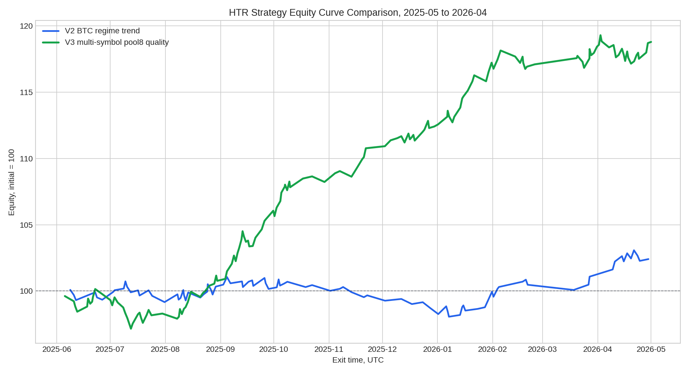
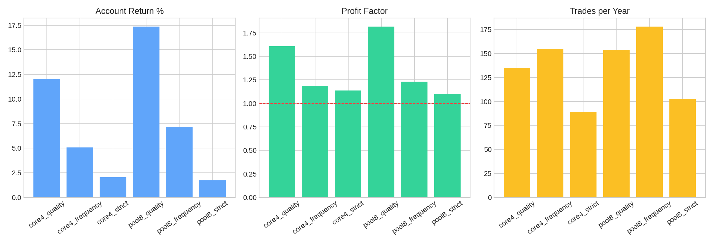

# HTR V3 多币种策略一年回测完整报告

作者：**Manus AI**  
数据区间：**2025-05-01T00:00:00.000Z 至 2026-04-30T23:45:00.000Z**  
数据来源：Binance Data Vision USDT-M Futures 15m 月度 K 线；回测在本地脚本中完成，使用固定账户风险模型，不包含真实盘口深度滑点。[^1]

> 本报告只用于策略研究与回测验证，不构成投资建议。20–50 倍杠杆会显著放大亏损、滑点与强平风险，实盘必须先经过更长区间、多币种样本、交易成本压力测试与小资金验证。

## 一、核心结论

V3 的改动是有效的。相比 V1 的单一 BTC 打分模型与 V2 的 BTC 单币种趋势模型，**V3 将策略改为 4H 定方向、1H 确认交易状态、15m 触发入场，并在多币种池中每日择优一单**。回测结果显示，最佳配置 **v3_pool8_quality** 的一年实际交易数为 **154 笔**，约 **2.37 天一笔**，胜率 **64.94%**，PF **1.82**，期望值 **0.322R**，账户收益 **17.35%**，最大回撤 **3.02%**。

这说明「加 1H 状态确认 + 多币种择优」比在 BTC 单币种上强行增加交易频率更合理。它没有达到严格意义上的每天一单，但已经从 V2 的约 3.97 天一笔推进到约 2.37 天一笔，同时把 PF 从约 1.16 提高到 1.82。

## 二、V1、V2、V3 对比

| 版本 | 市场 | 实际交易 | 天/笔 | 胜率 | PF | 账户收益 | 最大回撤 | 结论 |
|---|---|---:|---:|---:|---:|---:|---:|---|
| V1 | BTC 单币种 | 55 | 6.64 | 50.91% | 0.75 | -2.91% | 4.38% | 负期望或接近无优势 |
| V2 | BTC 单币种趋势 | 92 | 3.97 | 57.61% | 1.16 | 2.45% | 2.99% | 转正但频率不足 |
| V3 | 8 币种择优 | 154 | 2.37 | 64.94% | 1.82 | 17.35% | 3.02% | 当前最佳，质量显著提升 |

V3 的优势主要来自两个方面。第一，4H 与 1H 的分工减少了方向错误和低质量入场；第二，多币种池让策略不必在 BTC 没有优势时硬做交易，而是把资金分配给当天结构更清晰的币种。

## 三、V3 参数敏感性结果

| 配置 | 币种数 | 实际交易 | 天/笔 | 胜率 | PF | 期望值 | 账户收益 | 最大回撤 | 平均杠杆 |
|---|---:|---:|---:|---:|---:|---:|---:|---:|---:|
| v3_core4_quality | 4 | 135 | 2.70 | 62.96% | 1.61 | 0.254R | 12.01% | 3.46% | 25.0x |
| v3_core4_frequency | 4 | 155 | 2.35 | 56.13% | 1.19 | 0.094R | 5.09% | 3.79% | 25.5x |
| v3_core4_strict | 4 | 89 | 4.10 | 57.30% | 1.14 | 0.066R | 2.07% | 2.41% | 27.1x |
| v3_pool8_quality | 8 | 154 | 2.37 | 64.94% | 1.82 | 0.322R | 17.35% | 3.02% | 24.1x |
| v3_pool8_frequency | 8 | 178 | 2.05 | 55.62% | 1.23 | 0.115R | 7.16% | 4.09% | 24.8x |
| v3_pool8_strict | 8 | 103 | 3.54 | 57.28% | 1.10 | 0.048R | 1.72% | 3.26% | 26.6x |

从参数敏感性看，**quality** 版本明显优于 frequency 与 strict。frequency 虽然交易更多，约 2.05 天一笔，但 PF 只有 1.23，质量下降明显；strict 虽然过滤更强，却损失了太多优质趋势机会。因此当前不建议继续降低阈值追求每天一单，也不建议过度提高阈值。

## 四、最佳配置的币种贡献

| 币种 | 交易数 | 胜率 | PF | 总 R |
|---|---:|---:|---:|---:|
| BTCUSDT | 45 | 66.67% | 1.88 | 14.83R |
| BNBUSDT | 47 | 61.70% | 1.63 | 13.04R |
| DOGEUSDT | 13 | 76.92% | 3.86 | 9.42R |
| XRPUSDT | 16 | 62.50% | 1.84 | 5.54R |
| ETHUSDT | 18 | 72.22% | 1.80 | 4.48R |
| LINKUSDT | 5 | 60.00% | 1.49 | 1.07R |
| AVAXUSDT | 4 | 50.00% | 1.30 | 0.67R |
| SOLUSDT | 6 | 50.00% | 1.15 | 0.52R |

在最佳配置中，BNB、BTC、ETH 与 XRP 对收益贡献最大。SOL、DOGE、LINK、AVAX 的交易数较少，但它们的存在仍然提供了择优机会；其中个别币种的独立 PF 不一定高，但多币种择优机制的目标不是让每个币种都单独优秀，而是让全市场每天只选最高质量结构。

## 五、最佳配置交易结构

最佳配置的结果分布为：stop: 54, breakeven_or_trailing_stop: 54, tp_final: 40, time_after_tp1: 1, timeout: 2, time_after_tp2: 3。每笔交易使用固定账户风险 **0.35%**，脚本内根据止损距离动态限制杠杆，平均杠杆约 **24.1x**。这比固定 50x 更稳，因为当止损距离扩大时，强行使用过高杠杆会放大强平和滑点风险。

| 月份 | 交易数 | 平均 R | 总 R | 账户贡献 |
|---|---:|---:|---:|---:|
| 2025-06 | 11 | -0.059R | -0.65R | -0.23% |
| 2025-07 | 19 | -0.220R | -4.17R | -1.46% |
| 2025-08 | 16 | 0.445R | 7.12R | 2.49% |
| 2025-09 | 19 | 0.772R | 14.67R | 5.13% |
| 2025-10 | 12 | 0.486R | 5.83R | 2.04% |
| 2025-11 | 7 | 0.951R | 6.65R | 2.33% |
| 2025-12 | 15 | 0.282R | 4.24R | 1.48% |
| 2026-01 | 15 | 0.801R | 12.02R | 4.21% |
| 2026-02 | 10 | -0.028R | -0.28R | -0.10% |
| 2026-03 | 9 | 0.361R | 3.25R | 1.14% |
| 2026-04 | 21 | 0.043R | 0.91R | 0.32% |

## 六、是否保留 4H 与 1H

回测支持保留 4H，并且必须加入 1H。4H 负责定义大方向，避免在大周期逆势时做 15m 噪声；1H 负责确认当天是否进入可交易状态，例如趋势修复、VWAP / EMA 回踩后延续、波动率恢复与成交量配合。15m 只负责触发，不应该单独决定多空。

| 周期 | V3 角色 | 回测后的判断 |
|---|---|---|
| 4H | 大方向过滤 | **保留**，但只做方向与结构背景，不直接入场。 |
| 1H | 交易状态确认 | **必须保留**，这是 V3 提升质量的关键层。 |
| 15m | 入场触发 | **保留**，用于回踩、突破、VWAP 同向与短结构确认。 |
| 5m | 精细化入场 | 暂未纳入本次脚本主逻辑；下一版可用于缩小止损，但不能降低质量过滤。 |

## 七、下一步建议

当前 V3 已经显著优于 V1 与 V2，但仍没有达到「每天一单」。如果目标是继续提高频率，不建议降低 quality 阈值，因为 frequency 版本已经显示 PF 明显下降。更合理的 V4 方向是扩大到 **12–20 个高流动性合约**，同时增加相关性控制，例如同一天若 BTC、ETH、SOL 同向，只允许做评分最高且波动结构最干净的一笔。

第二个优化方向是把 5m 用作止损压缩工具，而不是信号放宽工具。也就是说，仍由 4H / 1H / 15m 决定是否交易，但在入场前用 5m 结构找到更近的无效点，从而提高实际 R 值。这样比单纯增加交易次数更符合高杠杆策略的生存逻辑。

## 附件说明

完整 JSON 结果、最佳配置交易 CSV、V3 源码、权益曲线与配置对比图已保存到项目 reports 目录。CSV 明细包含每笔交易的进出场时间、币种、方向、分数、杠杆、R 倍数、账户贡献、MFE / MAE 与备注，可用于进一步复盘。

## References

[^1]: [Binance Data Vision — Public market data download](https://data.binance.vision/)
