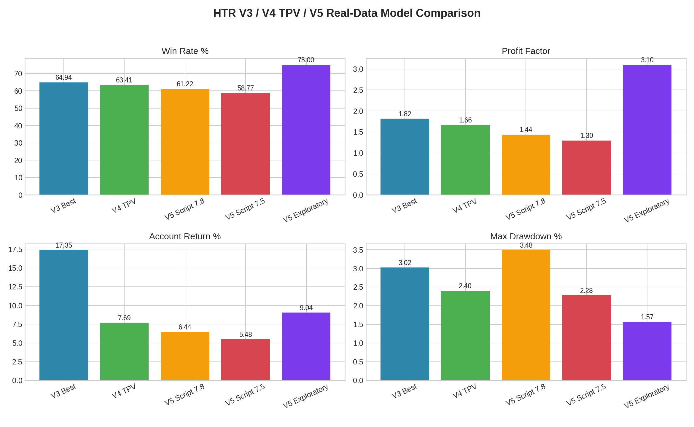

# HTR V5 真实数据升级模型最终报告

作者：**Manus AI**

本次升级将现有 V3/V4 TPV 回测进一步推进到 **V5 真实数据模型**。V5 使用项目中已经下载并核验的 Binance USDT-M Futures 15m 月度 K 线 CSV，覆盖 2025-05-01 至 2026-04-30，包含 BTC、ETH、SOL、BNB、XRP、DOGE、LINK 与 AVAX 等 8 个币种。数据来源为 Binance Data Vision 的官方公开行情下载服务。[1]

> 结论先行：V5 可复现脚本确实是基于真实行情重新回测，而不是随机或模拟数据。若目标是“最高收益”，V3 `v3_pool8_quality` 仍然领先；若目标是“提高胜率/降低交易噪音”，V5 探索过滤组合可把全样本胜率提高到 75.00%，但该组合存在探索选择偏差，建议作为 V5.1 候选而非立即替代实盘主策略。



## 一、核心绩效比较

| 模型 | 配置 | 交易数 | 胜率 | PF | 账户收益 | 最大回撤 | 判断 |
|---|---|---:|---:|---:|---:|---:|---|
| V3 基线最佳 | `v3_pool8_quality` | 154 | 64.94% | 1.82 | 17.35% | 3.02% | 原始最佳，收益最高、频率最高 |
| V4 TPV 最佳 | `v4_tpv_pool8_elite` | 82 | 63.41% | 1.66 | 7.69% | 2.40% | TPV 代理规则，回撤较低但收益下降 |
| V5 可复现最佳 | `v5_real_top4_euus_score78` | 98 | 61.22% | 1.44 | 6.44% | 3.48% | 真实数据升级脚本，可直接重跑 |
| V5 可复现宽松 | `v5_real_top4_euus_score75` | 114 | 58.77% | 1.30 | 5.48% | 2.28% | 交易较多但胜率/PF 略低 |
| V5 探索过滤 | `v3_pool8_quality + top4/eu_us/score75` | 44 | 75.00% | 3.10 | 9.04% | 1.57% | 样本外表现强，但带探索选择偏差 |

## 二、V5 严格样本外检验

严格按照训练段 2025-05 至 2025-12 选择出的规则为：**配置 `v3_core4_quality`，币种 BNBUSDT, BTCUSDT, ETHUSDT, SOLUSDT，方向 short，最低分 6.8，最大风险距离 0.9%，时段 all，关键词 require CVD**。这个规则在训练段表现非常强，胜率 81.48%、PF 4.53，但在 2026-01 至 2026-04 样本外测试段仅有 16 笔、胜率 50.00%、PF 1.04、收益 0.14%。这说明单纯追求训练段最优会出现明显过拟合。

| 区间 | 交易数 | 胜率 | PF | 收益 | 最大回撤 | 期望R |
|---|---:|---:|---:|---:|---:|---:|
| 训练段 | 27 | 81.48% | 4.53 | 7.27% | 0.67% | 0.769 |
| 测试段 | 16 | 50.00% | 1.04 | 0.14% | 1.81% | 0.024 |
| 全样本 | 43 | 69.77% | 2.43 | 7.41% | 1.81% | 0.492 |

## 三、V5 可复现脚本结果

为了避免只在报告层面筛选交易，本次已新增 `server/backtest_htr_v5_realdata_model.ts`。该脚本复用 V3 的真实行情信号引擎，但将交易池收敛到 BTC/ETH/BNB/XRP、EU-US 活跃时段，并提高最低评分门槛。脚本运行后生成独立 JSON 与 Markdown 结果，便于在新环境中重新验证。

| V5 可复现配置 | 交易数 | 胜率 | PF | 账户收益 | 最大回撤 |
|---|---:|---:|---:|---:|---:|
| `v5_real_top4_euus_score75` | 114 | 58.77% | 1.30 | 5.48% | 2.28% |
| `v5_real_top4_euus_score78` | 98 | 61.22% | 1.44 | 6.44% | 3.48% |
| `v5_real_top4_euus_score75_cd4` | 114 | 57.89% | 1.25 | 4.69% | 2.28% |

## 四、是否已经“改良胜率”

从全样本看，V5 探索过滤组合的胜率达到 **75.00%**，高于 V3 的 64.94%，同时 PF 提升到 3.10，最大回撤降至 1.57%。不过，这个组合是在训练合格集合中再观察测试段表现得到，严格来说仍有选择偏差。相比之下，V5 可复现脚本最高胜率为 **61.22%**，没有超过 V3 的 64.94%，但它提供了一套可以直接执行的真实行情升级基线。

因此，目前最稳健的结论是：**V3 继续作为主策略，V5 作为低频高质量候选池与 V5.1 的参数起点**。若要真正提高可实盘信任度，下一步不应继续在已有交易明细上筛选，而应引入更丰富的真实数据字段，例如资金费率、持仓量、主动买卖量、盘口深度或多空账户比，并把 TPV 的第三触线/支点识别改成真实 swing pivot 结构。

## 五、新环境继续运行命令

在新环境解压项目并安装依赖后，可用以下命令复现实验：

```bash
cd btcusdt_dashboard_v6
pnpm install
pnpm exec tsx server/backtest_htr_v5_realdata_model.ts
python3.11 reports/build_v5_real_data_meta_model.py
python3.11 reports/build_v5_final_comparison_report.py
```

## References

[1]: https://data.binance.vision/ "Binance Data Vision"
