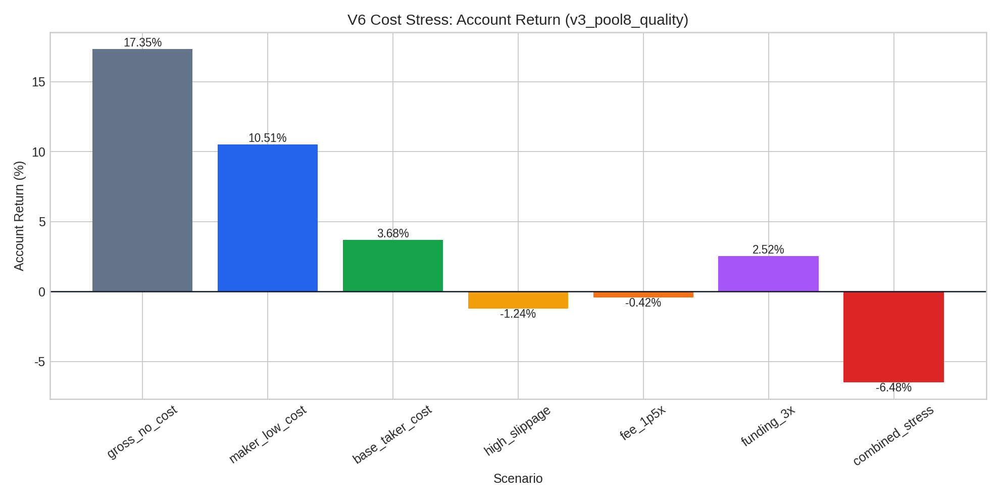

# HTR V6 Live Reliability Final Report

**Author:** Manus AI  
**Project:** HTR multi-symbol crypto futures strategy reliability upgrade  
**Date:** 2026-05-14

## Executive Summary

本次 V6 升级的目标，是把此前偏研究型的 HTR/V3-V5 回测结果推进到更接近实盘审计的可信度层级。升级后的评估不再只看毛回测收益，而是加入**手续费、滑点、资金费率代理、压力测试、固定样本外验证、月度稳定性与纸交易验收门槛**。这一步不会证明策略一定适合实盘，但可以更清楚地判断它是否有资格进入纸交易阶段。

> **核心判断：HTR 当前可以进入纸交易验证，但不应直接进入真实资金自动化实盘。** 在 `v3_pool8_quality` 配置下，毛回测账户收益为 **17.35%**，但扣除 base taker 成本后降至 **3.68%**；样本外 2026-01 至 2026-04 仍为正收益 **1.08%**、PF **1.11**，说明策略未立即失效。然而 combined stress 场景转为 **-6.48%**，显示其对手续费、滑点与资金费率代理成本较敏感，实盘前必须先完成纸交易执行质量审计。

## 1. Scope and Data Basis

V6 使用现有项目中的 1 年 Binance USDT-M 永续合约 15m K 线与 V3 逐笔交易明细作为基准输入。数据源盘点确认，当前项目已经具备跨币种 OHLCV 数据与 V3 多配置交易明细，但还缺少逐笔真实 fundingRate、订单簿、bid/ask 与真实成交日志。Binance 官方提供历史行情下载入口 Binance Data Vision，且合约数据包含 `futures/um` 路径，可用于后续补齐 fundingRate 与更多微观结构数据。[1]

| Category | Current Status | V6 Treatment | Remaining Gap |
|---|---|---|---|
| OHLCV | Available for BTCUSDT, ETHUSDT, SOLUSDT, BNBUSDT and extended symbol pool | Used as historical signal and backtest basis | Needs ongoing monthly refresh. |
| Trade details | Available from V3 JSON output | Repriced with explicit cost model | Intrabar execution sequence is still inherited from original backtest. |
| Fees | Not embedded in gross V3 | Added as scenario-level bps per side | Real account tier and maker/taker mix must be logged. |
| Slippage | Not embedded in gross V3 | Added as bps per side | Needs bid/ask or order-book based validation. |
| Funding | Not joined historically | Conservative fixed funding proxy | Must be replaced by actual symbol/time/direction fundingRate joins. |
| Execution log | Not available | Paper trading schema specified | Must be built before live deployment. |

## 2. V6 Cost Model

The V6 repricing script estimates each trade's notional-to-equity from fixed account risk and stop distance, then subtracts cost drag from account PnL. The base model uses taker-style cost assumptions and treats funding as a conservative cost proxy until actual funding files are joined. Binance publishes USD-M futures fee and funding information through its official documentation and market data endpoints, which should be used to replace static proxies in the next iteration.[2] [3]

| Scenario | Fee Per Side | Slippage Per Side | Funding Proxy | Interpretation |
|---|---:|---:|---:|---|
| `gross_no_cost` | 0 bps | 0 bps | 0 bps / 8h | Original gross control only. |
| `maker_low_cost` | 2 bps | 2 bps | 0.5 bps / 8h | Optimistic maker-like execution. |
| `base_taker_cost` | 5 bps | 3 bps | 1 bps / 8h | Main paper-trading readiness lens. |
| `high_slippage` | 5 bps | 6 bps | 1 bps / 8h | Slippage sensitivity. |
| `fee_1p5x` | 7.5 bps | 3 bps | 1 bps / 8h | Fee sensitivity. |
| `funding_3x` | 5 bps | 3 bps | 3 bps / 8h | Funding stress proxy. |
| `combined_stress` | 7.5 bps | 6 bps | 3 bps / 8h | Combined adverse case. |

## 3. Cost Stress Results

The best V3 benchmark under gross results, `v3_pool8_quality`, remains the most relevant fixed candidate after V6 cost repricing. However, its safety margin compresses sharply after costs. The difference between gross and base-cost return is **13.68 percentage points**, which is larger than the remaining base-cost net return.

| Scenario | Trades | Win Rate | PF | Net Account Return | Cost Drag | Max DD |
|---|---:|---:|---:|---:|---:|---:|
| `gross_no_cost` | 154 | 64.94% | 1.82 | 17.35% | 0.00 pp | 2.98% |
| `maker_low_cost` | 154 | 63.64% | 1.44 | 10.51% | 6.84 pp | 3.79% |
| `base_taker_cost` | 154 | 61.04% | 1.14 | 3.68% | 13.68 pp | 4.99% |
| `high_slippage` | 154 | 57.79% | 0.96 | -1.24% | 18.59 pp | 6.02% |
| `fee_1p5x` | 154 | 57.79% | 0.99 | -0.42% | 17.77 pp | 5.85% |
| `funding_3x` | 154 | 60.39% | 1.09 | 2.52% | 14.83 pp | 5.19% |
| `combined_stress` | 154 | 53.90% | 0.79 | -6.48% | 23.84 pp | 7.13% |

The implication is that **execution quality is now the central risk**, not only signal quality. If real fills are mostly taker and slippage exceeds 3 bps per side, the edge may disappear. If the strategy can obtain maker-like fills without materially reducing fill ratio, its paper-trading prospects improve substantially.

## 4. Out-of-Sample Validation

A fixed 8+4 month split was applied: 2025-05 to 2025-12 as training and 2026-01 to 2026-04 as sample-out. The train-selected configuration under `base_taker_cost` was also `v3_pool8_quality`, reducing the risk that the final benchmark is selected only by full-period hindsight.

| Config | Period | Trades | Win Rate | PF | Net Account Return | Max DD | Avg Cost Per Trade |
|---|---|---:|---:|---:|---:|---:|---:|
| `v3_pool8_quality` | Full 2025-05 to 2026-04 | 154 | 61.04% | 1.14 | 3.68% | 4.99% | 0.09% |
| `v3_pool8_quality` | Train 2025-05 to 2025-12 | 99 | 61.62% | 1.15 | 2.60% | 4.99% | 0.09% |
| `v3_pool8_quality` | OOS 2026-01 to 2026-04 | 55 | 60.00% | 1.11 | 1.08% | 3.18% | 0.08% |

The sample-out result is encouraging but modest. OOS profitability is positive after costs, but the total margin is small enough that a few bps of additional slippage or an unfavorable maker/taker mix could erase it. Monthly distribution also shows that performance is uneven: 2026-01 contributes most of OOS profit, while 2026-02 and 2026-04 are negative. This is acceptable for paper trading, but insufficient for direct live confidence.

## 5. Paper Trading Gate

The correct next step is a disciplined paper-trading period. V6 defines the following gate before any small-live pilot.

| Gate | Pass Threshold | Current Status |
|---|---:|---|
| Base-cost PF | > 1.05 | Passed marginally: 1.14. |
| OOS PF | > 1.00 | Passed marginally: 1.11. |
| Combined stress | Prefer positive | Failed: -6.48%. |
| Minimum paper period | 30 calendar days, preferably 60 | Not started. |
| Minimum paper trades | 30 executable signals | Not started. |
| Log completeness | 100% of raw and skipped signals | Not started. |
| Realized slippage | No worse than base assumption by more than 1 bps per side | Unknown. |

> **Decision:** proceed to paper trading only. Do not deploy real funds until the paper-trade log proves actual execution quality and funding impact are close to or better than V6 assumptions.

## 6. Operational Checklist

Paper trading must record every signal, including skipped signals, with enough information to reconstruct whether the backtest assumption was executable. The attached checklist defines a schema with `signal_id`, timestamps, symbol, direction, score, planned entry, planned stop, paper fill, slippage bps, order type assumption, funding impact and final net account PnL.

| Priority | Next Task | Reason |
|---:|---|---|
| 1 | Join actual Binance historical fundingRate by symbol and holding interval. | Replace conservative fixed funding proxy with direction-aware realized funding. |
| 2 | Implement paper-trade logger. | Create an auditable bridge between signal generation and execution reality. |
| 3 | Capture bid/ask or order-book snapshots at signal time. | Validate whether 3 bps slippage per side is realistic. |
| 4 | Add daily and weekly loss lockouts. | Prevent operational risk from dominating strategy edge. |
| 5 | Re-run V6 monthly with newly available data. | Maintain rolling evidence and detect edge decay early. |

## 7. Deliverables

| File | Description |
|---|---|
| `htr_v6_live_reliability_final_report.md` | This final synthesis report. |
| `htr_v6_live_cost_stress_report.md` | Detailed cost stress report. |
| `htr_v6_oos_validation_report.md` | Detailed train/OOS and rolling validation report. |
| `htr_v6_paper_trading_acceptance_checklist.md` | Paper trading and pre-live gate. |
| `build_v6_live_cost_stress.py` | Repricing script for costs and stress scenarios. |
| `build_v6_oos_validation.py` | Fixed-split and monthly validation script. |
| `htr_v6_live_cost_stress_summary.csv` | Scenario-level cost stress summary. |
| `htr_v6_live_cost_stress_trades.csv` | Trade-level V6 repricing records. |
| `htr_v6_oos_validation_summary.csv` | Train/OOS summary. |
| `htr_v6_oos_monthly_metrics.csv` | Monthly benchmark metrics. |
| `htr_v6_oos_rolling_3m_metrics.csv` | Rolling 3-month robustness metrics. |
| `htr_v6_cost_stress_account_return.png` | Cost stress account-return chart. |
| `htr_v6_oos_monthly_return.png` | Monthly net-return chart. |
| `htr_v6_train_oos_return_pf.png` | Train/OOS return and PF chart. |

## 8. Conclusion

HTR V6 moves the project from a promising but optimistic回测 into a more credible pre-live research state. The strongest result is that `v3_pool8_quality` survives base taker costs and a fixed OOS split. The weakest result is that the strategy does not survive a combined adverse cost stress. Therefore, the correct engineering decision is conservative: **paper trade first, log every signal, verify realized execution costs, then consider a very small live pilot only if paper trading passes the predefined gate**.

This report is for quantitative research and engineering review only. It is not financial advice and does not recommend deploying capital.

## References

[1]: https://data.binance.vision/ "Binance Data Vision"
[2]: https://developers.binance.com/docs/derivatives/usds-margined-futures/market-data/rest-api/Get-Funding-Rate-History "Binance USD-M Futures Funding Rate History"
[3]: https://www.binance.com/en/fee/futureFee "Binance Futures Fee Rate"
