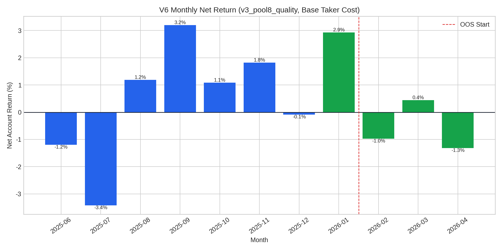
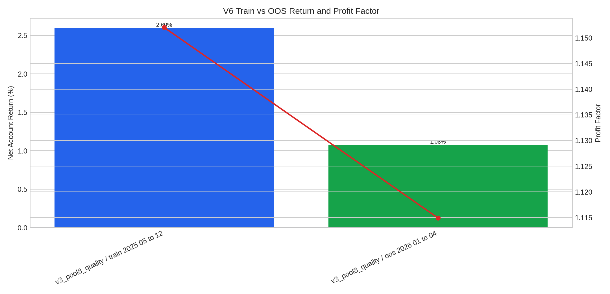

# V6 Out-of-Sample Validation Report

本报告将 2025-05 至 2026-04 的真实 Binance 15m K 线回测交易记录固定分割为**前 8 个月训练段**与**后 4 个月样本外段**。为了避免继续追逐回测数字，本阶段只使用上一阶段已经产生的 `base_taker_cost` 成本口径，即双边 taker 风格手续费、双边滑点与保守 funding 代理均已扣除。

> 关键结论：V3 基准配置 `v3_pool8_quality` 在样本外 2026-01 至 2026-04 录得 **1.08%** 净账户收益，PF 为 **1.11**，胜率为 **60.00%**，最大回撤为 **3.18%**。若仅按训练段表现选参，最佳训练配置为 `v3_pool8_quality`，其样本外收益为 **1.08%**，PF 为 **1.11**。

## Validation Design

| Item | Setting |
|---|---|
| Cost scenario | `base_taker_cost` |
| Train period | 2025-05-01 to 2025-12-31 UTC |
| OOS period | 2026-01-01 to 2026-04-30 UTC |
| Fixed benchmark | `v3_pool8_quality` |
| Train-selected config | `v3_pool8_quality` |
| Selection rule | Highest train net account return, PF as secondary check |

## Train vs OOS Summary

| config           | period                  |   trades |   win_rate_pct |   profit_factor |   net_account_return_pct |   max_drawdown_pct |   avg_cost_account_pct |
|:-----------------|:------------------------|---------:|---------------:|----------------:|-------------------------:|-------------------:|-----------------------:|
| v3_pool8_quality | full_2025_05_to_2026_04 |      154 |          61.04 |            1.14 |                     3.68 |               4.99 |                   0.09 |
| v3_pool8_quality | oos_2026_01_to_04       |       55 |          60    |            1.11 |                     1.08 |               3.18 |                   0.08 |
| v3_pool8_quality | train_2025_05_to_12     |       99 |          61.62 |            1.15 |                     2.6  |               4.99 |                   0.09 |

## Monthly Stability for Fixed V3 Benchmark

| period   |   trades |   win_rate_pct |   profit_factor |   net_account_return_pct |   max_drawdown_pct |
|:---------|---------:|---------------:|----------------:|-------------------------:|-------------------:|
| 2025-06  |       11 |          45.45 |            0.58 |                    -1.19 |               1.9  |
| 2025-07  |       19 |          36.84 |            0.39 |                    -3.42 |               3.7  |
| 2025-08  |       16 |          75    |            1.64 |                     1.19 |               0.48 |
| 2025-09  |       19 |          68.42 |            2.48 |                     3.2  |               1.62 |
| 2025-10  |       12 |          66.67 |            1.59 |                     1.09 |               0.48 |
| 2025-11  |        7 |          85.71 |            4.97 |                     1.82 |               0.46 |
| 2025-12  |       15 |          66.67 |            0.96 |                    -0.08 |               0.81 |
| 2026-01  |       15 |          80    |            3.13 |                     2.93 |               0.91 |
| 2026-02  |       10 |          50    |            0.6  |                    -0.97 |               1.61 |
| 2026-03  |        9 |          66.67 |            1.32 |                     0.44 |               0.9  |
| 2026-04  |       21 |          47.62 |            0.69 |                    -1.32 |               2.7  |

## Rolling 3-Month Robustness for Fixed V3 Benchmark

| period           |   trades |   win_rate_pct |   profit_factor |   net_account_return_pct |   max_drawdown_pct |
|:-----------------|---------:|---------------:|----------------:|-------------------------:|-------------------:|
| 2025-06..2025-08 |       46 |          52.17 |            0.67 |                    -3.42 |               4.99 |
| 2025-07..2025-09 |       54 |          59.26 |            1.1  |                     0.97 |               3.84 |
| 2025-08..2025-10 |       47 |          70.21 |            1.94 |                     5.48 |               1.62 |
| 2025-09..2025-11 |       38 |          71.05 |            2.37 |                     6.11 |               1.62 |
| 2025-10..2025-12 |       34 |          70.59 |            1.61 |                     2.82 |               0.81 |
| 2025-11..2026-01 |       37 |          75.68 |            2.13 |                     4.66 |               0.92 |
| 2025-12..2026-02 |       40 |          67.5  |            1.31 |                     1.87 |               1.61 |
| 2026-01..2026-03 |       34 |          67.65 |            1.47 |                     2.4  |               1.96 |
| 2026-02..2026-04 |       40 |          52.5  |            0.77 |                    -1.85 |               3.18 |

## Interpretation

严格样本外口径说明，`v3_pool8_quality` 在扣除实盘代理成本后仍未彻底失效，但安全边际明显低于 V3 毛回测。若 OOS 收益主要由少数月份贡献，纸交易阶段必须特别关注信号频率、成交质量与连续亏损窗口。相较于继续调高胜率，V6 更应优先解决三件事：补齐真实 fundingRate 数据、记录真实挂单/吃单比例，以及用纸交易日志验证信号出现后是否能以回测假设价格成交。

## Generated Files

| File | Purpose |
|---|---|
| `htr_v6_oos_validation_summary.csv` | Train/OOS summary for fixed benchmark and train-selected config. |
| `htr_v6_oos_monthly_metrics.csv` | Monthly stability metrics for `v3_pool8_quality`. |
| `htr_v6_oos_rolling_3m_metrics.csv` | Rolling 3-month robustness metrics. |
| `htr_v6_oos_validation_results.json` | Structured validation output. |
| `htr_v6_oos_monthly_return.png` | Monthly English-label chart. |
| `htr_v6_train_oos_return_pf.png` | Train/OOS return and PF chart. |
