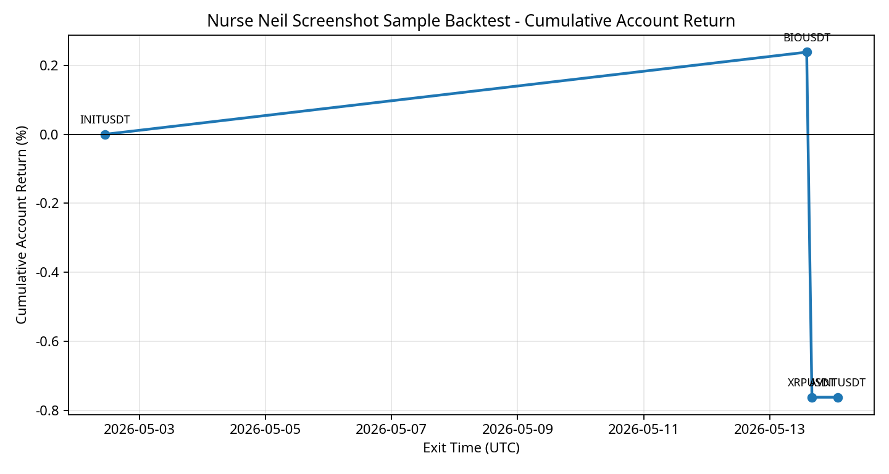

# Nurse Neil 外部訊號樣本回測報告

本次回測不是完整策略績效檢定，而是對截圖中可讀出完整數字的訊號做事件級 replay。樣本數太小，不能用來估計長期勝率、Sharpe 或容量；它的價值在於驗證接入流程、成本口徑、止損/止盈邏輯，以及篩選門檻是否能避免低分訊號進入風險池。

## 回測口徑

本回測使用 Binance USD-M Futures 15m OHLCV 行情，對每筆訊號在訊號時間後立即按截圖中的 CMP/entry 建倉，並以訊號週期的 **收盤跌破止損** 作為失效條件。止盈採分批出場，預設每邊 taker fee 為 `5.0` bps，每邊滑點為 `5.0` bps，最長持有 `14` 天。帳戶層風險按照先前 Nurse Neil 評分模組映射：90 分以上 1.0% 風險、70–89 分降倉、60 分以下不交易。

| 指標 | 數值 |
|---|---:|
| 截圖訊號總數 | 4 |
| 有行情資料訊號 | 4 |
| 實際交易事件 | 4 |
| 分數過濾事件 | 0 |
| 至少觸發一個 TP 的事件 | 2 |
| 收盤止損事件 | 3 |
| 平均 realized R | 0.0185 |
| 中位 realized R | 0.0608 |
| 帳戶總收益率 | -0.7619% |
| 平均名義淨收益率 | 0.6069% |

## 事件結果

| symbol   | timeframe   |   score |   entry |   stop_loss | take_profits               | exit_reason      |   tp_hit_count |   realized_r |   net_return_pct_on_notional |   suggested_account_risk_pct |   account_return_pct | data_status         |
|:---------|:------------|--------:|--------:|------------:|:---------------------------|:-----------------|---------------:|-------------:|-----------------------------:|-----------------------------:|---------------------:|:--------------------|
| INITUSDT | 1H          |      49 | 0.091   |      0.0883 | 0.0965,0.1113,0.1333       | close_below_stop |              1 |       0.5185 |                       1.3385 |                         0    |               0      | binance_futures_api |
| AVNTUSDT | 4H          |      59 | 0.1554  |      0.1428 | 0.2291,0.3117              | max_hold_close   |              0 |      -0.3968 |                      -3.4175 |                         0    |               0      | binance_futures_api |
| BIOUSDT  | 2H          |     nan | 0.04792 |      0.044  | 0.05181,0.05694,0.06573    | close_below_stop |              2 |       0.9523 |                       7.5901 |                         0.25 |               0.2381 | binance_futures_api |
| XRPUSDT  | 4H          |      96 | 1.4601  |      1.418  | 1.5288,1.619,1.7423,1.8665 | close_below_stop |              0 |      -1      |                      -3.0834 |                         1    |              -1      | binance_futures_api |

## 成交明細

| signal_id            | symbol   | timestamp_utc        | fill_type   |   price |   weight |   gross_r_multiple |   net_return_pct_on_notional |
|:---------------------|:---------|:---------------------|:------------|--------:|---------:|-------------------:|-----------------------------:|
| INIT_2026-04-28_2203 | INITUSDT | 2026-04-28T14:30:00Z | TP1         | 0.0965  |     0.5  |           2.03704  |                      2.97198 |
| INIT_2026-04-28_2203 | INITUSDT | 2026-05-02T11:00:00Z | STOP_CLOSE  | 0.0883  |     0.5  |          -1        |                     -1.53352 |
| AVNT_2026-05-07_0024 | AVNTUSDT | 2026-05-14T01:45:00Z | TIME_EXIT   | 0.1504  |     1    |          -0.396825 |                     -3.3175  |
| BIO_2026-05-09_0029  | BIOUSDT  | 2026-05-08T19:30:00Z | TP1         | 0.05181 |     0.4  |           0.992347 |                      3.20708 |
| BIO_2026-05-09_0029  | BIOUSDT  | 2026-05-09T19:15:00Z | TP2         | 0.05694 |     0.35 |           2.30102  |                      6.55306 |
| BIO_2026-05-09_0029  | BIOUSDT  | 2026-05-13T14:00:00Z | STOP_CLOSE  | 0.044   |     0.25 |          -1        |                     -2.07008 |
| XRP_2026-05-11_0928  | XRPUSDT  | 2026-05-13T16:00:00Z | STOP_CLOSE  | 1.418   |     1    |          -1        |                     -2.98336 |

## 分數門檻與滑點敏感度

|   score_threshold |   slippage_bps_per_side |   traded_events |   filtered_events |   signals_with_data |   mean_realized_r |   total_account_return_pct |   mean_net_notional_return_pct |
|------------------:|------------------------:|----------------:|------------------:|--------------------:|------------------:|---------------------------:|-------------------------------:|
|                 0 |                       5 |               4 |                 0 |                   4 |            0.0185 |                    -0.7619 |                         0.6069 |
|                 0 |                      15 |               4 |                 0 |                   4 |            0.0185 |                    -0.7619 |                         0.4069 |
|                60 |                       5 |               2 |                 2 |                   2 |           -0.0238 |                    -0.7619 |                         2.2533 |
|                60 |                      15 |               2 |                 2 |                   2 |           -0.0238 |                    -0.7619 |                         2.0534 |
|                70 |                       5 |               2 |                 2 |                   2 |           -0.0238 |                    -0.7619 |                         2.2533 |
|                70 |                      15 |               2 |                 2 |                   2 |           -0.0238 |                    -0.7619 |                         2.0534 |
|                80 |                       5 |               2 |                 2 |                   2 |           -0.0238 |                    -0.7619 |                         2.2533 |
|                80 |                      15 |               2 |                 2 |                   2 |           -0.0238 |                    -0.7619 |                         2.0534 |
|                90 |                       5 |               2 |                 2 |                   2 |           -0.0238 |                    -0.7619 |                         2.2533 |
|                90 |                      15 |               2 |                 2 |                   2 |           -0.0238 |                    -0.7619 |                         2.0534 |

## 解讀

若只有高分訊號進入交易池，樣本會非常少，但能顯著降低小幣種與 1H scalp 的噪音暴露。若完全不設分數門檻，回測結果更像「訊號提供者所有喊單」的跟單測試，會混入原本評分模組已拒絕的 INIT、AVNT 等交易。從系統接入角度，較合理的第一階段不是追求回測收益最大化，而是要求所有外部訊號必須留下可審計的 entry、stop、TP、score、成本後 realized R 與帳戶風險。

## 限制與下一步

第一，截圖樣本只有少數訊號，而且部分訊號缺少完整 TP 或準確入場價，因此本報告只納入可讀出完整數字的事件。第二，Nurse Neil 訊號原文常使用「TPs above」或圖中顏色線，若沒有 OCR/人工校對的結構化資料，就不能做大樣本統計。第三，下一步應建立至少 100–200 筆歷史訊號表，然後用同一腳本重跑，才能判斷 Score ≥ 70、Score ≥ 80、只做 4H、排除 BTC 4H 破位等門檻是否真的有統計優勢。
