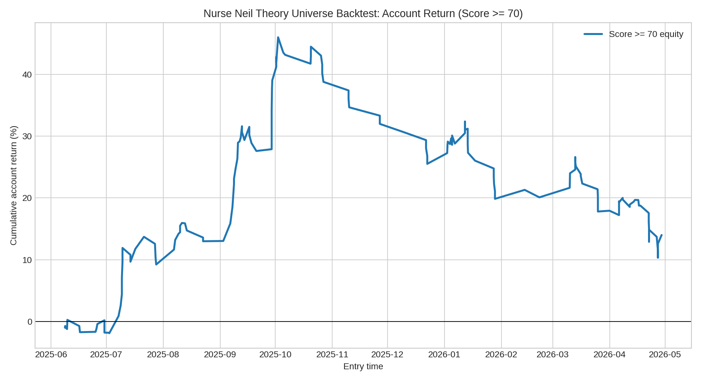
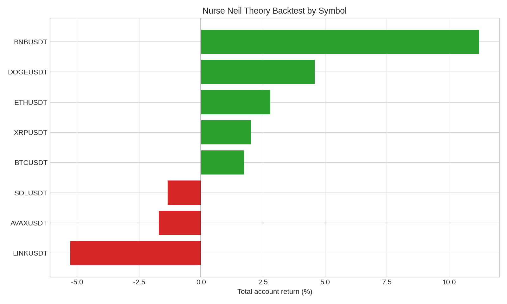

# Nurse Neil 理論規則多幣種回測報告

本次回測不是回放 Discord/社群實際喊單，而是把你提供的 Nurse Neil 理論拆成可重複執行的機械條件，套用到 V6 系統目前已有的 Binance USD-M 15m 多幣種行情，並統一轉為 4H 結構交易。其目的在於回答：這套「下跌後結構轉強、突破/SR flip、均線確認、明確 SL、分批 TP、分數控倉」理論，在目前系統已有幣種上是否具備可量化優勢。

## 回測 universe 與規則

Universe 為 `AVAXUSDT, BNBUSDT, BTCUSDT, DOGEUSDT, ETHUSDT, LINKUSDT, SOLUSDT, XRPUSDT`，資料期間為 `2025-05-01 00:00:00+00:00` 至 `2026-05-01 00:00:00+00:00`。回測使用 4H K 線，入場條件要求價格突破前 20 根 4H 高點、收盤站上 EMA20/EMA50、入場未相對突破位追高超過 3.5%、止損距離不超過 6%，並通過 BTC 4H 大盤過濾。止損採「收盤跌破止損」；止盈以 1.5R、2.5R、4R、6R 分批出場；base 成本採每邊 taker fee 5 bps 與每邊滑點 5 bps。

## 核心結果

| 口徑               |   trades |   symbols |   win_rate_pct |   mean_gross_r |   median_gross_r |   total_account_return_pct |   max_drawdown_pct |   profit_factor |   mean_score |   mean_net_notional_return_pct |
|:-----------------|---------:|----------:|---------------:|---------------:|-----------------:|---------------------------:|-------------------:|----------------:|-------------:|-------------------------------:|
| 全部機械訊號           |      153 |         8 |        44.4444 |         0.1003 |          -0.2500 |                    13.9872 |           -23.6668 |          1.2066 |      94.0000 |                         0.2298 |
| Score >= 70      |      153 |         8 |        44.4444 |         0.1003 |          -0.2500 |                    13.9872 |           -23.6668 |          1.2066 |      94.0000 |                         0.2298 |
| Score >= 80      |      153 |         8 |        44.4444 |         0.1003 |          -0.2500 |                    13.9872 |           -23.6668 |          1.2066 |      94.0000 |                         0.2298 |
| Score >= 70 壓力滑點 |      153 |         8 |        44.4444 |         0.1003 |          -0.2500 |                    13.9872 |           -23.6668 |          1.2066 |      94.0000 |                         0.0298 |

## 門檻敏感度

| scenario          |   score_threshold |   trades |   symbols |   win_rate_pct |   mean_gross_r |   total_account_return_pct |   max_drawdown_pct |   profit_factor |   mean_score |
|:------------------|------------------:|---------:|----------:|---------------:|---------------:|---------------------------:|-------------------:|----------------:|-------------:|
| base_5bps_slip    |                 0 |      153 |         8 |        44.4444 |         0.1003 |                    13.9872 |           -23.6668 |          1.2066 |      94.0000 |
| stress_15bps_slip |                 0 |      153 |         8 |        44.4444 |         0.1003 |                    13.9872 |           -23.6668 |          1.2066 |      94.0000 |
| base_5bps_slip    |                60 |      153 |         8 |        44.4444 |         0.1003 |                    13.9872 |           -23.6668 |          1.2066 |      94.0000 |
| stress_15bps_slip |                60 |      153 |         8 |        44.4444 |         0.1003 |                    13.9872 |           -23.6668 |          1.2066 |      94.0000 |
| base_5bps_slip    |                70 |      153 |         8 |        44.4444 |         0.1003 |                    13.9872 |           -23.6668 |          1.2066 |      94.0000 |
| stress_15bps_slip |                70 |      153 |         8 |        44.4444 |         0.1003 |                    13.9872 |           -23.6668 |          1.2066 |      94.0000 |
| base_5bps_slip    |                80 |      153 |         8 |        44.4444 |         0.1003 |                    13.9872 |           -23.6668 |          1.2066 |      94.0000 |
| stress_15bps_slip |                80 |      153 |         8 |        44.4444 |         0.1003 |                    13.9872 |           -23.6668 |          1.2066 |      94.0000 |
| base_5bps_slip    |                85 |      153 |         8 |        44.4444 |         0.1003 |                    13.9872 |           -23.6668 |          1.2066 |      94.0000 |
| stress_15bps_slip |                85 |      153 |         8 |        44.4444 |         0.1003 |                    13.9872 |           -23.6668 |          1.2066 |      94.0000 |
| base_5bps_slip    |                90 |      145 |         8 |        44.1379 |         0.0725 |                     9.9910 |           -23.2684 |          1.1578 |      94.3103 |
| stress_15bps_slip |                90 |      145 |         8 |        44.1379 |         0.0725 |                     9.9910 |           -23.2684 |          1.1578 |      94.3103 |

## 分幣種結果

| symbol   |   trades |   win_rate_pct |   mean_gross_r |   total_account_return_pct |   max_drawdown_pct |   profit_factor |   mean_score |
|:---------|---------:|---------------:|---------------:|---------------------------:|-------------------:|----------------:|-------------:|
| BNBUSDT  |       37 |        48.6486 |         0.2956 |                    11.2084 |            -7.8894 |          1.7744 |      93.8919 |
| DOGEUSDT |       10 |        50.0000 |         0.5435 |                     4.5857 |            -2.9701 |          2.1536 |      89.2000 |
| ETHUSDT  |       25 |        52.0000 |         0.1169 |                     2.7945 |            -4.9010 |          1.2597 |      95.6800 |
| XRPUSDT  |       13 |        38.4615 |         0.1608 |                     2.0165 |            -1.6961 |          1.3850 |      94.5385 |
| BTCUSDT  |       34 |        47.0588 |         0.0559 |                     1.7323 |            -3.5719 |          1.1370 |      96.7353 |
| SOLUSDT  |       15 |        40.0000 |        -0.0856 |                    -1.3479 |            -4.5725 |          0.8262 |      92.7333 |
| AVAXUSDT |        6 |        16.6667 |        -0.3167 |                    -1.7053 |            -4.6608 |          0.6526 |      89.6667 |
| LINKUSDT |       13 |        30.7692 |        -0.3658 |                    -5.2650 |            -5.8951 |          0.3009 |      90.5385 |

## 解讀

如果 Score >= 70 的口徑能保持正收益、較低回撤且壓力滑點後仍不崩潰，則這套理論可以作為 V6 系統的候選多幣種結構掃描器；若收益主要集中在少數幣或少數月份，則應只保留為「提示/觀察」而非自動交易訊號。由於目前 universe 只有系統既有 8 個幣種，且全部是相對高流動性的主流或中大型幣，本結果不能直接外推到 Nurse Neil 原始截圖中更小市值的新幣。

## 下一步

建議把這個腳本接入每日掃描流程，先只輸出候選而不自動下單；同時擴充行情 universe 到 Nurse Neil 常喊的小幣，並加入真實 funding、order book spread、訊號延遲與同時持倉上限。只有當 Score >= 70 或 Score >= 80 在擴充樣本與走樣本外期間仍穩定，才值得升級為紙交易。
